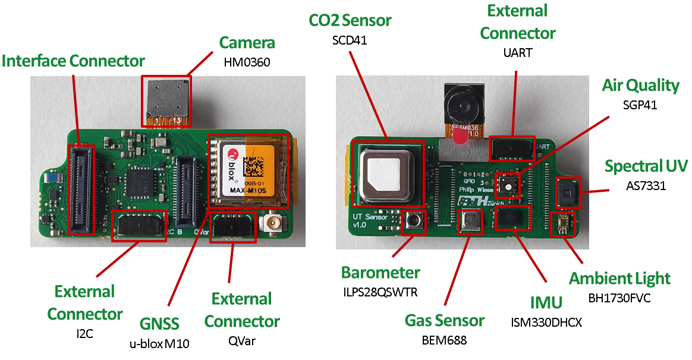

# SENSEI Sensor Shield

This repository contains the hardware design files for the **SENSEI Sensor Shield**, a versatile extension developed as part of the **Urban Twin** project. The sensor shield integrates multiple sensors for environmental monitoring and is designed to work seamlessly with the [SENSEI Base Board](https://github.com/pulp-bio/sensei-base-board), offering advanced data collection capabilities for urban sensing and other applications.

## Overview

The **SENSEI Sensor Shield** is an extension board designed to support a wide range of sensors for environmental data acquisition. It can be used in urban monitoring scenarios, including air quality monitoring, light sensing, and structural health diagnostics. Developed under the **Urban Twin** project, it is built for flexibility and long-term deployment, making it ideal for multi-sensor applications.



### Key Features
- **Optical Sensors**:
  - **Ultraviolet (UVA, UVB, UVC)** sensing.
  - **Infrared and Visual light** sensing.
  - **Camera (HM0360)**: 640 x 480 resolution at 60 fps.

- **Environmental Sensors**:
  - **CO2 Sensor (SCD41)**.
  - **Air Quality Sensor (SGP41)**.
  - **Barometer (ILPS28QSWTR)**.
  - **Gas Sensor (BME688)**.
  - **Quasi-Electrostatic Potential (QVar)** for detecting potential changes.

- **Position/IMU Sensors**:
  - **IMU (ISM330DHCX)**: Advanced 6 DOF sensor for motion tracking and vibration analysis.
  - **GNSS (u-blox M10)** for accurate geolocation.

- **External Connectors**:
  - **I2C, UART**, and **GPIO** for seamless integration of additional peripherals.

### Software Development Kit (SDK)
The **SENSEI SDK** provides software support for both the **SENSEI Base Board** and the **SENSEI Sensor Shield**. It includes sensor drivers, power management, and communication tasks to facilitate data collection and processing. The SDK is available at [SENSEI SDK Repository](https://github.com/pulp-bio/sensei-sdk).

### Demo Applications
- YOLOv5 Occupancy Detection: https://github.com/pulp-bio/sensei-demo-yolov5
- Sensor Readout: https://github.com/pulp-bio/sensei-demo-sensorhub

## Changelog
A detailed changelog is available in the [Changelog.md](Changelog.md) file, which tracks all major updates and revisions to the board's design and documentation.

## Contributors
- **Philip Wiese** ([wiesep@iis.ee.ethz.ch](mailto:wiesep@iis.ee.ethz.ch))
- **Sebastian Frey** ([sefrey@iis.ee.ethz.ch](mailto:sefrey@iis.ee.ethz.ch))

## Publications

If you use the SENSEI Sensor Shield in your work or research, you can cite us with:

### COINS 2025: A Multi-Modal IoT Node for Energy-Efficient Environmental Monitoring with Edge AI Processing
```
@misc{wiese2025multimodaliotnodeenergyefficient,
      title={A Multi-Modal IoT Node for Energy-Efficient Environmental Monitoring with Edge AI Processing},
      author={Philip Wiese and Victor Kartsch and Marco Guermandi and Luca Benini},
      year={2025},
      eprint={2507.14165},
      archivePrefix={arXiv},
      primaryClass={eess.SP},
      url={https://arxiv.org/abs/2507.14165},
}
```
This paper has been accepted at 2025 IEEE International Conference on Omni-layer Intelligent Systems (COINS) and the preprint is available on arXiv @ [arXiv:2507.14165](https://arxiv.org/abs/2507.14165).

### SENSEI Paper
```
TBD
```

## License
This repository makes use of two licenses:
- for all *software*: Apache License Version 2.0
- for all *hardware*: Solderpad Hardware License Version 0.51

For further information have a look at the license files: `LICENSE.hw`, `LICENSE.sw`